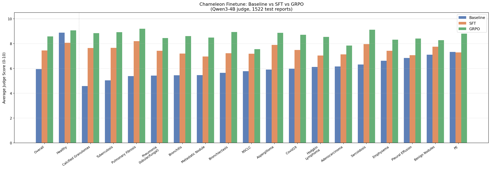
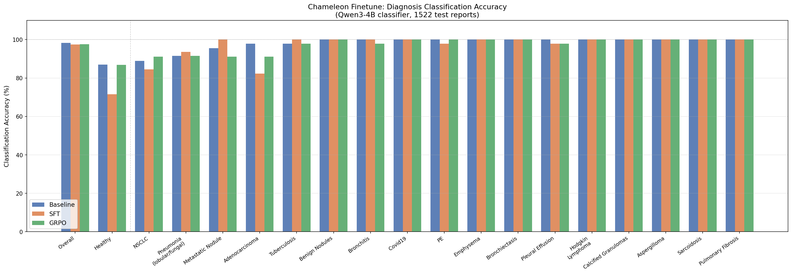

# Chameleon Finetune

Finetuning experiments on the [Chameleon Dataset](https://huggingface.co/datasets/prashant-kikani/chameleon-chest-ct-radiology-reports) — 10,000 synthetic chest CT radiology reports spanning 17 thoracic pathologies plus healthy scans.

**Task:** Given CT findings, generate the impression section of a radiology report.

**Model:** Qwen3-4B (QLoRA, r=16)

**Pipeline:** Baseline → SFT → GRPO

---

## Results

### Judge Score (0–10, Qwen3-4B judge)

| | Baseline | SFT | GRPO |
|---|---|---|---|
| **Overall** | 6.00 | 7.47 | 8.55 |
| **Positive cases** | 6.00 | 7.47 | 8.55 |
| **Healthy** | 8.87 | 8.06 | 9.06 |

### Diagnosis Classification Accuracy

Baseline classification accuracy was already high (98.3% on positive cases). SFT caused slight regression on some categories; GRPO recovered to near-baseline.

---

## Approach

### Data
- **Dataset:** Chameleon — 10k synthetic chest CT reports (GPT-4o generated, radiologist validated)
- **Split:** 70/15/15 stratified by pathology → 6990 train / 1486 val / 1522 test
- **Preprocessing:** stripped markdown bold markers, attending physician boilerplate, pulmonary nodule follow-up boilerplate

### SFT
- Base model: `Qwen/Qwen3-4B`
- QLoRA: r=16, α=32, all projection layers
- 3 epochs, lr=2e-4 cosine, effective batch size 16
- Loss only on assistant turn (`assistant_only_loss=True`)

### GRPO
- Initialized from SFT checkpoint
- 500 steps, lr=5e-6, G=4 completions per prompt
- Reward: Qwen3-4B judge served locally, scores 0–10
- Judge model kept frozen at base weights throughout training

---

## Files

| File | Description |
|---|---|
| `parse_reports.py` | Parse CSVs → clean JSONL splits |
| `sft.py` | SFT training with QLoRA |
| `grpo.py` | GRPO post-training |
| `harness.py` | Evaluation harness (generate + judge) |
| `judge_server.py` | FastAPI judge server (Qwen3-4B) |
| `classify.py` | Binary classification correctness evaluator |
| `rescore_zeros.py` | Patch script for zero-score artifacts |
